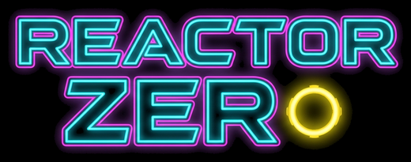
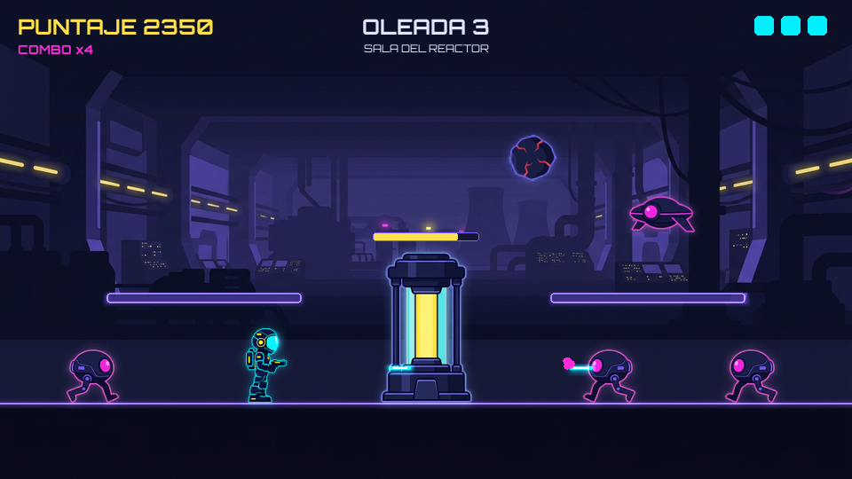
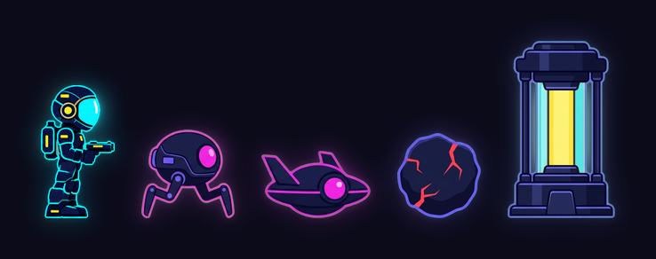
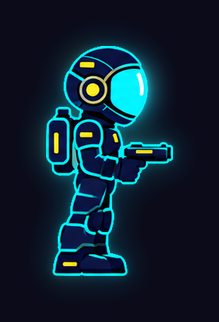
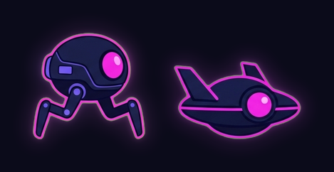
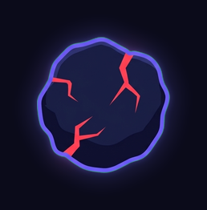
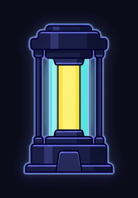

<p align="center"></p>

# Reactor Zero

Mini juego arcade hecho con Python y pygame para el parcial de Algoritmia, cuyo tema es la **verificación formal de programas**.

Eres el último técnico de la estación Aurora. Una tormenta de meteoritos trajo algo que tomó el control de los drones de mantenimiento, y ahora avanzan en oleadas hacia el Reactor Zero, que mantiene con vida a la colonia. No hay que recorrer un mundo: hay que **defender una posición**.

<p align="center"></p>

- Los drones dañan al reactor cuando lo alcanzan, y a ti si te tocan.
- Los meteoritos no se pueden destruir; una marca roja avisa dónde caen y las plataformas te cubren.
- Cada oleada superada cambia de sector y acelera a los enemigos.
- Pierdes si la energía del reactor llega a 0 o si te quedas sin vidas.

## Cómo jugar

Hace falta [uv](https://docs.astral.sh/uv/), que descarga Python y las dependencias la primera vez.

```bash
uv run main.py
```

| Tecla | Acción |
|---|---|
| A / D o flechas izquierda / derecha | Mover |
| W, flecha arriba o Espacio | Saltar |
| J | Disparar |
| Esc o P | Pausa |

En el menú, las flechas izquierda / derecha ajustan el volumen. La intro se salta con cualquier tecla.

## Entidades

Todo lo que aparece en la partida es una **entidad**: tiene posición, vida, daño y una pose que se dibuja. La clase base valida los valores con los que se crea cada una, y las clases hijas solo cambian lo que las distingue.

<p align="center"></p>

### `Entidad` — la clase base

Define unos límites para la vida y el daño iniciales. Cada clase hija puede sobrescribirlos, y el mismo constructor valida con los límites de la hija. Para calcular el daño usa `aplicar_danio`, una de las funciones verificadas.

```python
class Entidad:
    # Delimitadores de los valores con los que se crea la entidad.
    VIDA_INICIAL_MAX = 1000
    VIDA_INICIAL_MIN = 50
    DANIO_MAX = 500
    DANIO_MIN = 25

    POSE_INICIAL = None

    def __init__(self, nombre: str, vida: int, danio: int, x: float, y: float):
        self.x = x
        self.y = y
        self.activo = True
        self.voltear = False
        self.pose = self.POSE_INICIAL

        if nombre not in HOJAS:
            raise ValueError(f"No existe la hoja de sprites '{nombre}'")
        self.nombre = nombre

        validar_rango("La vida", vida, self.VIDA_INICIAL_MIN, self.VIDA_INICIAL_MAX)
        self.vida = vida
        self.vida_max = vida

        validar_rango("El daño", danio, self.DANIO_MIN, self.DANIO_MAX)
        self.danio = danio

    def recibir_danio(self, danio: int):
        if danio < 0:
            raise ValueError("El daño recibido no puede ser negativo")
        self.vida = aplicar_danio(self.vida, danio)
        if self.vida == 0:
            self.activo = False

    def atacar(self, objetivo: "Entidad"):
        objetivo.recibir_danio(self.danio)
```

### Clases hijas

<table>
<tr>
<td width="68%">

**`Jugador`** — el técnico. Añade el apodo que se guarda en el ranking, con su propia validación.

```python
class Jugador(Entidad):
    APODO_MAX = 15
    APODO_MIN = 3

    POSE_INICIAL = "quieto"

    def __init__(self, apodo, vida, danio, x, y):
        super().__init__("jugador", vida, danio, x, y)

        if len(apodo) > self.APODO_MAX:
            raise ValueError(...)
        if len(apodo) < self.APODO_MIN:
            raise ValueError(...)
        self.apodo = apodo
```

</td>
<td align="center"></td>
</tr>
<tr>
<td>

**`Dron`** — el enemigo. Una sola clase para los dos tipos: el tipo decide qué hoja de sprites usa y si vuela.

```python
class Dron(Entidad):
    TIPOS = ("terrestre", "volador")

    def __init__(self, tipo, vida, danio, x, y):
        if tipo not in self.TIPOS:
            raise ValueError(...)
        super().__init__(f"dron_{tipo}", vida, danio, x, y)

        self.tipo = tipo
        self.volar = tipo == "volador"
        self.pose = "volar_a" if self.volar else "caminar_a"
```

</td>
<td align="center"></td>
</tr>
<tr>
<td>

**`Meteorito`** — el obstáculo. No se puede destruir: fija su vida en 1 y sobrescribe `recibir_danio` para que no haga nada.

```python
class Meteorito(Entidad):
    VIDA_INICIAL_MAX = 1
    VIDA_INICIAL_MIN = 1

    ROCAS = 3

    def __init__(self, roca, danio, x, y):
        if roca < 1 or roca > self.ROCAS:
            raise ValueError(...)
        super().__init__("meteorito", 1, danio, x, y)
        self.pose = f"roca_{roca}"

    def recibir_danio(self, danio: int):
        pass
```

</td>
<td align="center"></td>
</tr>
<tr>
<td>

**`Reactor`** — lo que hay que defender. No ataca: sobrescribe los límites de daño para que solo acepte 0.

```python
class Reactor(Entidad):
    DANIO_MAX = 0
    DANIO_MIN = 0

    POSE_INICIAL = "sano"

    def __init__(self, vida, x, y):
        super().__init__("reactor", vida, 0, x, y)
```

</td>
<td align="center"></td>
</tr>
</table>

Los fragmentos están resumidos; el código completo está en `juego/entity/`. El disparo del jugador (`Disparo`) es una clase aparte que no hereda de `Entidad`, porque no tiene vida ni hoja de sprites.

## Lógica verificada

Las funciones que están en `juego/logic/`, en Python puro y con su precondición `{P}` y postcondición `{Q}` como comentario.

| Archivo | Funciones |
|---|---|
| `sin_ciclos.py` | `mover_jugador`, `velocidad_oleada`, `sumar_puntaje`, `aplicar_danio` |
| `condicionales.py` | `clasificar_impacto`, `ajustar_volumen`, `mover_seleccion` |
| `ciclos.py` | `contar_activos`, `indice_maximo_desde` |
| `arreglos.py` | `intercambiar`, `ordenar_ranking` |

## Organización del código

| Carpeta | Contenido |
|---|---|
| `juego/logic/` | Las funciones verificadas. No importa pygame ni otras carpetas. |
| `juego/entity/` | Las entidades de esta página. |
| `juego/engine/` | Reglas de la partida, pantallas, intro, música, ranking y valores de dificultad (`config.py`). |
| `juego/asset_processor/` | Carga y dibujo del arte. |
| `herramientas/` | Procesar las imágenes originales y crear el ejecutable. |
| `tests/` | Pruebas de la lógica y de partidas simuladas sin ventana. |

## Pruebas

```bash
uv run pytest
```

## Crear el ejecutable

```bash
uv run herramientas/crear_ejecutable.py
```

Genera `dist/ReactorZero.exe`, un solo archivo que no necesita Python ni uv. Guarda `ranking.json` en la carpeta donde esté.

## Cambiar el arte

Las imágenes originales están en `assets/raw/`. Después de añadir o reemplazar una hay que regenerar los sprites:

```bash
uv run herramientas/procesar_assets.py
```

`uv run demo.py` muestra cada personaje con todas sus poses, sin lógica de juego.